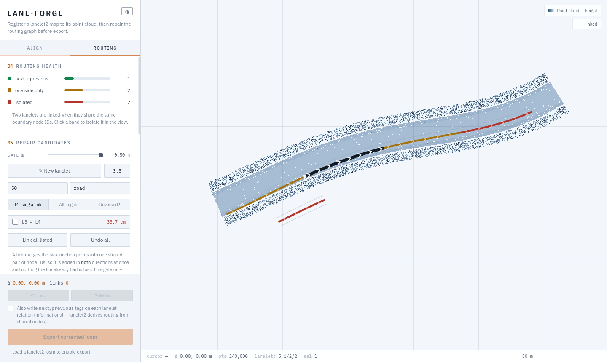

# LaneForge

A single-file browser tool for aligning a [lanelet2](https://github.com/fzi-forschungszentrum-informatik/Lanelet2) vector map to its point cloud and repairing the routing graph before you feed it to Autoware.

Open `laneforge.html` in a browser. There is no build step, no server and no dependencies. Your files are read locally by the page — nothing is uploaded anywhere.

---

## Why

An HD map arriving from a mapping tool or a simulator export usually needs two kinds of work before it is usable:

1. **Registration** — the vector map sits a metre or two off the point cloud, or is rotated slightly.
2. **Routing** — lanelets that should follow one another do not, because their boundaries do not quite share the same nodes; some lanelets are drawn backwards; some have their left and right boundaries labelled the wrong way round.

Both are tedious to fix in a text editor and hard to see in a generic viewer. LaneForge shows the two layers on top of each other, lets you nudge one onto the other, then shows the routing graph as colour and lets you repair it lanelet by lanelet.

---

## Quick start

1. Open `laneforge.html`.
2. **Align** tab → load your `.pcd` and your `.osm` (click the slots, or drag the files onto the page).
3. **Autoware frame** → load your `map_projector_info.yaml`, or tick **generate** if you have none (see below — skipping this is why a map can look aligned here and still be off in Autoware).
4. Drag in the view to slide the vector map onto the cloud. Arrow keys nudge by the selected step.
5. **Routing** tab → inspect the graph, fix what is broken.
6. **Export** — the corrected `.osm`, plus `map_projector_info.yaml` when generating.

The page opens on a small synthetic demo scene so every control works before you load anything.

---

## Align

The point cloud is the fixed reference; the vector map moves.

- **Drag** in the view moves the map. Middle-drag, right-drag, `Space`-drag or `Alt`-drag pans the view.
- **Arrow keys** nudge by the step selected (0.05 / 0.25 / 1 / 5 m). `Shift` multiplies by ten.
- **ΔX / ΔY / yaw** can be typed directly. Yaw rotates about the map's own centre.
- Cloud brightness, opacity, point size and lane width are adjustable; the cloud is coloured by height.

Once you leave the Align tab the offset is **locked**, so a stray click hours into a routing session cannot move the map. Arrow keys say so rather than silently doing nothing.

Large clouds are subsampled for display (3 M points; the ratio is shown). Panning drops to a coarser raster and returns to full detail when you stop.

Supported `.pcd`: `ascii`, `binary` and `binary_compressed` (LZF), with `x`/`y`/`z` in any field layout.

---

## Autoware frame (`map_projector_info.yaml`)

Autoware does not use the positions this page draws. It rebuilds each node's metric position itself, following `map_projector_info.yaml` (`autoware_map_loader`), and loads the point cloud unchanged in that same frame:

| `projector_type` | where Autoware puts a node |
| --- | --- |
| `Local` | at its `local_x` / `local_y` tags — lat/lon ignored |
| `MGRS` | its lat/lon projected to UTM, then taken **inside its own 100 km square** (0–100 000 m) — local tags ignored |
| `LocalCartesianUTM` | its lat/lon in UTM, minus `map_origin` — local tags ignored |
| `TransverseMercator` | its lat/lon in transverse Mercator about `map_origin` — local tags ignored |
| `LocalCartesian` | east/north of `map_origin` — local tags ignored |

With no yaml at all, Autoware assumes **MGRS**. So a map aligned by its `local_x`/`local_y` tags only lines up in Autoware when the yaml is `Local`; with any other type the alignment is lost, by however far the file's lat/lon disagree with its local tags — metres, or tens of kilometres for MGRS. Vector Map Builder works the same way: it places the map from lat/lon in an MGRS square and the cloud as-is.

**You have the yaml.** Load it. The map is then drawn exactly the way Autoware builds it, so what lines up here lines up there. Export writes lat/lon through that projector (and `local_x`/`local_y` to the same values). A map that crosses an MGRS square boundary is reported, because Autoware's MGRS projector tears it apart there.

**You don't.** Tick **generate** and pick a type; the `.osm` and a matching `map_projector_info.yaml` download together. The map stays in its own frame while you align, and export writes coordinates that put every node where you left it:

- **Local** (default) — for a cloud from CARLA or another simulator. Autoware reads `local_x`/`local_y`, added to every node where missing. The cloud is never modified. Lat/lon-based features (GNSS localisation) are off with this type.
- **LocalCartesianUTM / TransverseMercator / LocalCartesian** — the same frame, but georeferenced at the origin you enter; lat/lon are written to match.
- **MGRS** — only when every node sits between 0 and 100 000 m. A cloud centred near 0,0, as CARLA's is, has negative coordinates that MGRS cannot hold, and export refuses with the reason rather than writing a map that lands 100 km away.

The projections reproduce `autoware_lanelet2_extension` / `lanelet2_projection` and agree with PROJ to well under a millimetre.

One thing no alignment can fix: if the file's lat/lon were produced with a *different* projection from the yaml, the map is slightly scaled relative to the cloud (a few decimetres over a few hundred metres). Translation and yaw cannot remove a scale error. If the file also has correct `local_x`/`local_y`, generate a projector instead of trusting the old lat/lon.

The browser console (F12) logs a `[LaneForge]` line for each load and export: the frame used, the projector, and a sample node before and after.

---

## Routing

### Health

Every lanelet is drawn in its own colour:

| colour | meaning |
| --- | --- |
| green | has both a next and a previous |
| yellow | has one side only |
| red | isolated |

Click a band in the panel to isolate just those lanelets in the view. Small chevrons run along each lanelet in its direction of travel, faint on everything once you zoom in and bright on the selection, so a backwards lanelet stands out against the flow around it.

### Repair candidates

A scan lists pairs whose joints are within the gate (capped at **0.50 m**, both boundary ends must qualify). Rows are sorted closest-first; clicking one flies to it, ticking it applies the link. **Missing a link** filters to lanelets that actually lack a connection; **All in gate** shows every join in range.

### Reversed?

A third filter tries each lanelet reversed on its own and lists only those that **gain** links, ranked by how many. It counts joins that would form outright plus gaps the reversal would bring inside the gate, so a lanelet that is both backwards *and* short of its neighbour is still found.

This matters because reversing on a hunch is destructive: a lanelet that already runs the right way loses its links when flipped. The scan never proposes one of those, and reversing a lanelet that still has links asks for confirmation first.

### Links

Select a lanelet and its `next` and `previous` lists become editable. Type an id, or leave the box empty and press **+ next** to arm pick-from-map, then click the lanelet you mean — a banner tells you what it is waiting for and `Esc` cancels. Adding a successor sets the other lanelet's predecessor at the same time; a lanelet can hold as many of each as the junction needs.

Every lanelet id is offered, sorted nearest-first with its real joint distance. Nothing is refused — the map may simply be wrong and need it — but a link past the gate quotes exactly how far the geometry will jump and how many boundary ways it will drag, and only applies on a second, deliberate press.

### Direction and handedness

These are two separate things, and confusing them is the most common source of trouble:

- **⇄ Reverse** flips the direction of travel. That swaps which end is the start *and* which boundary is on the left.
- **⇋ Swap L/R** only relabels the boundaries. Geometry does not move.

When two lanelets already touch but their left/right labels disagree, the reported gap is exactly one lane width — a distance that is really a labelling error. LaneForge detects this (the crossed pairing is closer than the straight one) and **relabels instead of moving anything**, telling you so.

### Shape

**◇ Edit shape** puts a handle on every boundary vertex of the selected lanelet. Drag to bend the lane; the boundary, the lane width and the centreline recompute live. Nodes shared with a neighbouring lanelet move for both — that is one node in the file, and it is what keeps the boundary continuous.

### Speed limits

Select one lanelet, shift-click to add more, or drag a box with the left button to take a whole zone, then apply one speed to all of them. Entry is in km/h by default with an mph toggle; **the file is always written in km/h as a bare number**, which is how lanelet2 reads an untagged value. Reading is more permissive: a bare number, `mph` or `m/s` are all understood.

### Create and delete

**✎ New lanelet** draws a centreline; `Enter` finishes, `Backspace` drops a point, `Esc` cancels. The result is a real lanelet — nodes, two boundary ways and the relation — added straight into the model, so you can immediately link it, reverse it, reshape it or set its speed.

**🗑 Delete** removes a lanelet from the graph and drops its relation on export. Its boundary ways are left in place, because a neighbouring lane usually shares them.

---

## How lanelet2 connectivity actually works

Worth knowing, because it explains everything the tool does.

**There is no `next` or `previous` field.** Lanelet B follows lanelet A when B's two boundaries *begin at the same node ids* that A's boundaries *end at*. Connectivity is node identity, not proximity.

Three consequences:

- **A link is a merge.** Joining two lanelets means making one junction out of two, which moves the follower's start onto the leader's end. Within a few centimetres that is a harmless snap. Across metres it teleports geometry.
- **Adjacent lanes share boundary ways.** One node is commonly the endpoint of three to five boundary ways, so a merge drags every line that rides on it — including lanelets that were not part of the link. This is correct for a small snap and destructive for a large one.
- **A single edge often cannot be removed.** Once several lanelets share one junction they are all each other's neighbours. Removing one edge means taking the junction apart, so the tool removes the merge responsible and says which.

LaneForge watches for the failure mode this creates: if a lane's two boundaries are ever pulled onto the same point, a warning appears naming the affected lanelets. It does not block you — it flashes, and `Ctrl+Z` or **Undo all** puts the geometry back exactly.

---

## Export

**Export corrected .osm** writes a new file next to your original. Everything not edited passes through byte-for-byte.

- **Geometry.** Both `lat`/`lon` and the `local_x`/`local_y` tags are rewritten together, so whichever one your pipeline reads they stay in agreement. With a projector (loaded or generated) lat/lon are computed through it; see **Autoware frame**.
- **Without a projector.** Node lat/lon receive the *delta* rather than being recomputed, so an untouched node keeps its original value exactly. Metres-per-degree is solved from the file itself by least squares over its own `lat`/`lon` ↔ `local_x`/`local_y` pairs, and the residual is reported. Files without local coordinates are projected from lat/lon about an origin that is written into the export as a comment, so re-opening it keeps the alignment.
- **Routing.** Links rewrite the relevant boundary way endpoints. Reversals turn the way node order and swap the member roles; where a boundary is shared with a lanelet that is *not* reversed, the reversed lanelet gets its own copy so the neighbour is untouched.
- **`next` / `previous` tags** can optionally be written on each relation. They are informational — lanelet2 derives routing from shared nodes, not from tags.

Every edit is stored as intent and replayed from the untouched file, so undo is exact and the export always derives from the original rather than from an accumulated state.

---

## Keyboard and mouse

| | |
| --- | --- |
| left drag | move the map (Align) · box-select (Routing) |
| left click | select a lanelet |
| middle / right / `Space` / `Alt` drag | pan the view |
| wheel | zoom about the cursor |
| shift-click | add or remove from the selection |
| arrows | nudge the offset (Align only) |
| `Shift` + arrows | nudge ×10 |
| `Ctrl+Z` / `Ctrl+Shift+Z` / `Ctrl+Y` | undo / redo (250 steps) |
| `Esc` | cancel a pick, a draft or the selection |
| `Enter` / `Backspace` | finish / un-do a point while drawing |

Selection is by containment: click anywhere inside a lane and you get that lane, at any zoom. Lanes do not overlap, so neighbouring carriageway lanes stay separable.

---

## Notes and limits

- Undo covers links, cuts, reversals, swaps, vertex moves, speeds, deletions, creations and the alignment offset. Creating and deleting are each other's inverse.
- Closing or reloading with unsaved edits prompts for confirmation.
- Light and dark themes; the choice is remembered and follows your OS setting on first run.
- Elevation is not edited. `ele` tags pass through untouched.
- Lane-change (adjacency) relations are not edited. Reversing a lanelet whose boundary is shared gives it a private copy of that way, which does end the sharing for that pair.
- A newly drawn lanelet starts isolated, and its ends are unlikely to fall inside the 0.50 m gate. Draw it so its ends land on the lanelets it should join, or drag the end vertices onto them with **Edit shape** first, then link with no movement.
- Very large point clouds are limited by browser memory. A 230 MB / 19 M point cloud loads comfortably on a desktop browser.

---

2. Install the Converter

Clone the Tier IV repository and build the container.
Bash

git clone [https://github.com/tier4/autoware_lanelet2_to_opendrive.git](https://github.com/tier4/autoware_lanelet2_to_opendrive.git)
cd autoware_lanelet2_to_opendrive
docker compose --profile convert build convert

3. Convert the Map

Use map.projector_type=Local to force the converter to strictly trust the local_x and local_y tags written by LaneForge, preventing MGRS grid distortions.
Bash

docker run --rm \
  -v "$PWD:/io" \
  -v "$HOME/laneforge:/maps" \
  l2o-convert:local \
  map=example \
  map.projector_type=Local \
  target=carla \
  input_map_path=/maps/map_corrected.osm \
  output_map_path=/maps/map_carla.xodr

4. Reclaim File Ownership

Because Docker runs as the root user, the new files will be locked. Run this to take back ownership:
Bash

sudo chown $USER:$USER ~/laneforge/map_carla.xodr ~/laneforge/map_carla.mapping.json

Option 2: Automated Local Watcher Script (No Docker)

If you prefer to avoid Docker, you can configure your native Python environment to continuously watch your folder and automatically generate the OpenDRIVE file the exact second you hit "Export" in LaneForge.
1. Fix the Local Library Conflict

Hide the static archive so CMake links to the correct shared libraries during the build.
Bash

sudo apt update
sudo apt install -y python3.10-dev libpython3.10
sudo mv /usr/local/lib/libpython3.10.a /usr/local/lib/libpython3.10.a.bak

2. Install the Converter using uv
Bash

git clone [https://github.com/tier4/autoware_lanelet2_to_opendrive.git](https://github.com/tier4/autoware_lanelet2_to_opendrive.git)
cd autoware_lanelet2_to_opendrive
uv cache clean
uv sync --dev

3. Create the Watcher Script

Save the following code as watch_and_convert.py in your ~/laneforge/ directory.
Python

import os
import time
import subprocess

WATCH_DIR = os.path.expanduser("~/laneforge")
CONVERTER_DIR = os.path.expanduser("~/laneforge/autoware_lanelet2_to_opendrive")
processed = set()

print(f"Watching {WATCH_DIR} for new _corrected.osm files...")

while True:
    for file in os.listdir(WATCH_DIR):
        if file.endswith("_corrected.osm") and file not in processed:
            osm_path = os.path.join(WATCH_DIR, file)
            xodr_path = osm_path.replace(".osm", ".xodr")
            
            print(f"\nNew map detected: {file}")
            print("Converting to OpenDRIVE...")
            
            cmd = [
                "uv", "run", "python", "-m", "autoware_lanelet2_to_opendrive.main",
                f"input_map_path={osm_path}",
                f"output_map_path={xodr_path}",
                "map=example",
                "map.projector_type=Local",
                "target=carla"
            ]
            
            subprocess.run(cmd, cwd=CONVERTER_DIR)
            processed.add(file)
            print(f"Done! Saved as {xodr_path}")
            
    time.sleep(2)

4. Run the Watcher

Run the script in the background while you use LaneForge in your browser. Whenever you click "Export corrected .osm", the script will detect the download and instantly build your .xodr file next to it.
Bash

python3 ~/laneforge/watch_and_convert.py

MIT — see [LICENSE](LICENSE).
